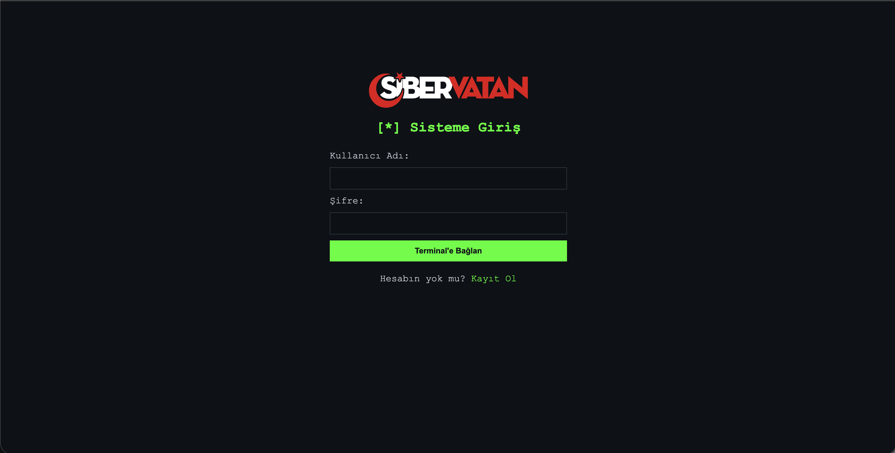
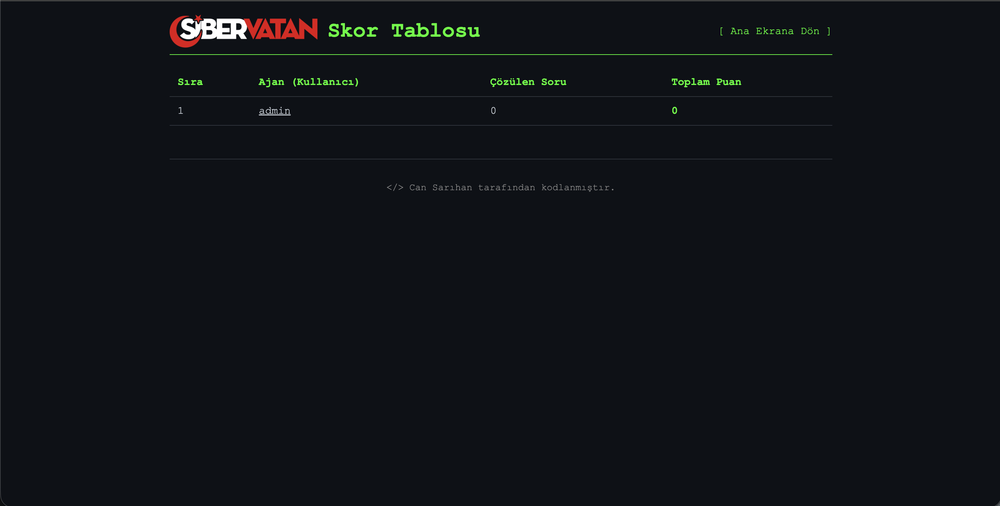
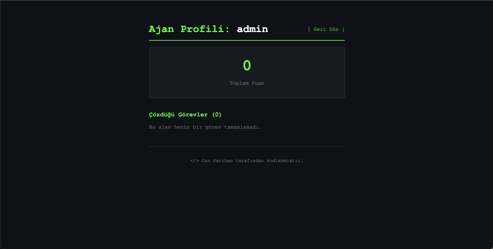
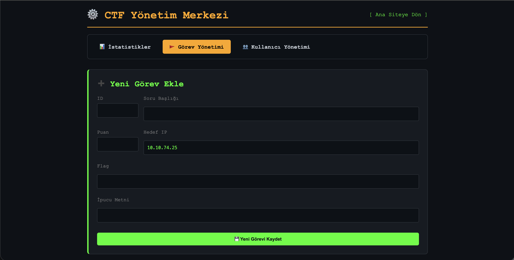
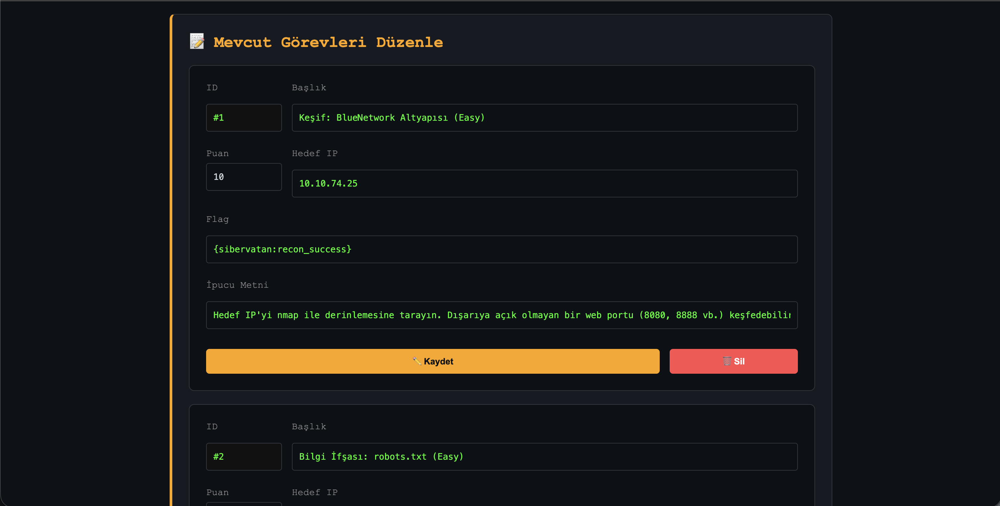
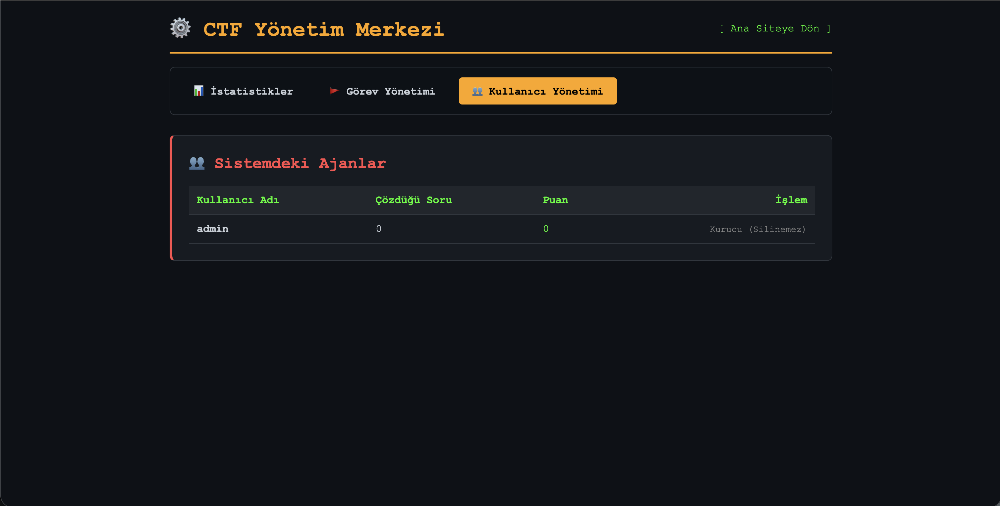

# 🛡️ SiberVatan CTF Platformu

SiberVatan, siber güvenliğe yeni başlayanlar için tasarlanmış, hikaye tabanlı ve modüler bir **CTF (Capture The Flag)** yönetim platformudur. Bu proje, **Siber Vatan** eğitimleri kapsamında adayların pratik yapması için geliştirilmiştir.

## 📸 Ekran Görüntüleri (Arayüz)

### 👤 Kullanıcı Arayüzü
Giriş ekranından itibaren kullanıcılar terminal tabanlı bir deneyimle karşılanır.

| Giriş Ekranı | Görev Paneli (Dashboard) |
| :---: | :---: |
|  |  |

| Skor Tablosu (Leaderboard) | Kullanıcı Profil Detayı |
| :---: | :---: |
|  |  |

---

### ⚙️ Yönetim Paneli (Admin)
Yöneticiler, platformu tamamen dinamik bir şekilde kontrol edebilir.

| Admin İstatistikleri | Yeni Görev Ekleme |
| :---: | :---: |
|  |  |

| Görev Düzenleme ve IP Yönetimi | Kullanıcı Yönetimi |
| :---: | :---: |
|  |  |

---

## ✨ Öne Çıkan Özellikler
- **Kademeli Eğitim:** Kolay, Orta ve Zor seviye makinelerle ilerleyen zorluk eğrisi.
- **Güvenli Kimlik Doğrulama:** Bcrypt kütüphanesi ile şifrelerin hashlenerek saklanması.
- **Rol Tabanlı Yetkilendirme:** Gelişmiş Admin paneli kontrolü (`isAdmin: true/false`).
- **Canlı Sistem Hissiyatı:** Neon Pulse CSS animasyonları ile interaktif dashboard.
- **Pwned Sistemi:** Başarıyla çözülen görevler için görsel geri bildirim ve otomatik puanlama.

## 📂 Proje Yapısı
- `app.js`: Uygulamanın ana giriş noktası ve sunucu mantığı.
- `views/`: EJS şablon motoru ile hazırlanan dinamik sayfalar.
- `public/`: CSS stilleri ve kurumsal görsellerin bulunduğu klasör.
- `challenges.json`: Görev veri tabanı (Flagler, İpuçları, IP'ler).
- `users.json`: Kullanıcı profilleri (Local DB).
- `1-kolay.sh`, `2-orta.sh`, `3-zor.sh`: Otomatik makine kurulum scriptleri.

## 🛠️ Kurulum ve Çalıştırma

### 1. Hazırlık
```bash
npm install# sibervatan-ctf-panel
